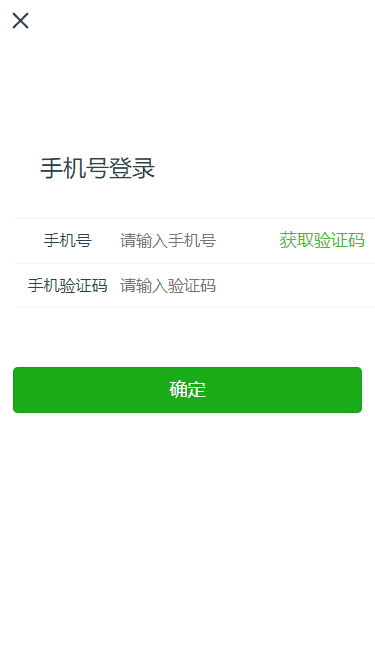
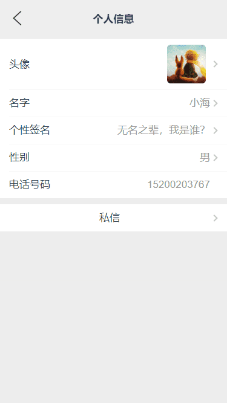
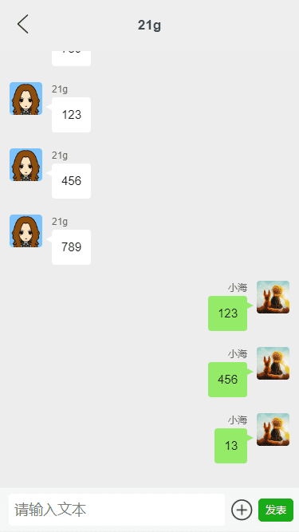
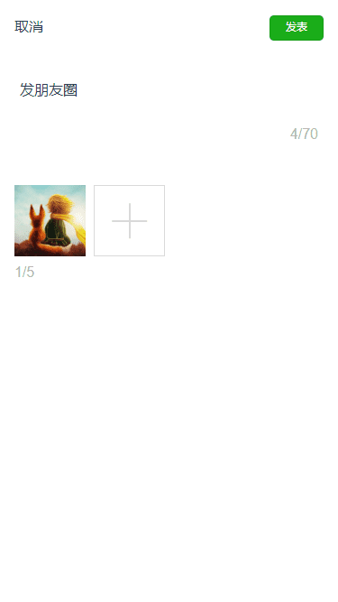
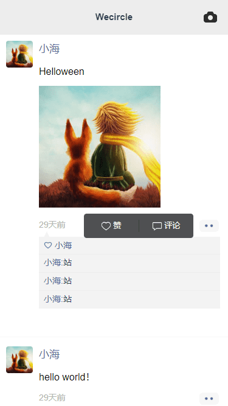
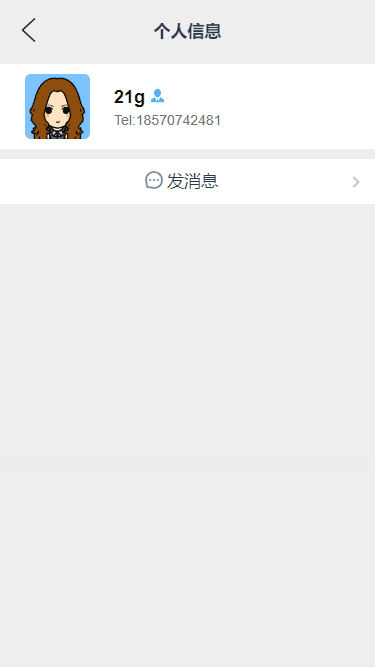

# 朋友圈移动Web App

## 项目描述

本项目使用Vue+WeUI开发客户端页面，Express+MongoDB开发服务段接口。

项目主要包括登陆页、朋友圈发布、朋友圈评论、私信聊天、个人信息展示页等。

## 如何运行

+ 克隆代码：`https://github.com/VueToLRH/vue-wecircle.git`
+ 安装依赖：`npm install`
+ 客户端运行：`npm run serve`
+ 服务端运行：`node .\server\bin\www`
+ 打包：`npm run build`
+ ESlint检查：`npm run lint`

## 基础知识

+ 滚动组件 [scrollView](./src/components/scrollView/index.vue) 开发

## 项目展示

