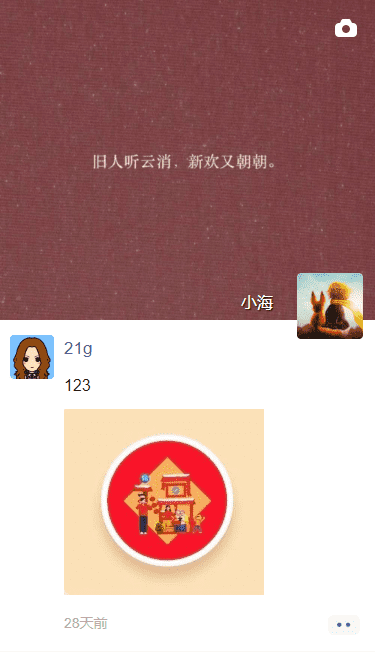

# 朋友圈移动Web App

## 项目描述

本项目使用Vue+WeUI开发客户端页面，Express+MongoDB开发服务段接口。

项目主要包括登陆页、朋友圈发布、朋友圈评论、私信聊天、个人信息展示页等。

## 如何运行

+ 克隆代码：`https://github.com/VueToLRH/vue-wecircle.git`
+ 安装依赖：`npm install`
+ 客户端运行：`npm run serve`
+ 服务端运行：`node .\server\bin\www`
+ 打包：`npm run build`
+ ESlint检查：`npm run lint`

## 基础知识

+ 屏幕适配方案：`vw方案`
+ 滚动组件 [scrollView](./src/components/scrollView/index.vue) 开发
+ 用户短信登录：接入阿里云短信服务 [sms.js](./server/utils/sms.js)
+ 跨域配置：[具体实现参考服务端app.js中跨域的配置](./server/app.js)
+ 用户验证方式：[JSON Web Token](./readme/JSON_Web_Token.md)
+ 朋友圈阿里云OSS图片上传：[具体实现参考服务端post.js中上传图片配置](./server/routes/post.js)
+ [移动端键盘高度问题](./readme/KeyboardInput.md)：具体实现可参考组件[inputBar](./src/components/inputBar/index.vue)

## 使用插件/模块

+ [postcss-px-to-viewport](https://github.com/evrone/postcss-px-to-viewport/blob/master/README_CN.md)：用于进行px和vw之间的转换，具体配置[postcss.config.js](./postcss.config.js)
+ [svg-captcha](https://github.com/produck/svg-captcha/blob/HEAD/README_CN.md)：第三方验证码模块，提供基于SVG图片格式的验证码(相对于一般图片SVG格式更不容易被机器人识别)。[具体使用参考：server/routes/users.js](./server/routes/users.js)
+ [jsonwebtoken](https://github.com/auth0/node-jsonwebtoken#readme)：`JSON Web Token`方案的实现
+ [@alicloud/pop-core](https://help.aliyun.com/document_detail/112185.html?spm=a2c4g.11186623.6.634.6ae256e0SAVgOS)：阿里云短信服务Node.js SDK
+ [multer](https://github.com/expressjs/multer/blob/master/README.md)：用于Node.js的multipart/form-data请求数据处理的中间件，multer在解析完请求体后，会向Request对象中添加一个body对象和一个file或files对象（上传多个文件时使用files对象 ）,同时可以设置storage来配置存储的路径，对于使用Express的项目来说，可以很方便的完成文件上传存储功能。
+ [ali-oss](https://www.alibabacloud.com/help/zh/doc-detail/32068.htm?spm=a2c63.p38356.879954.10.6e5d64cd9y9fKY#concept-32068-zh)：阿里云Node.js SDK上传图片

## 项目展示

