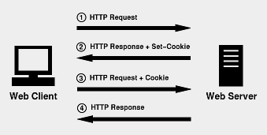
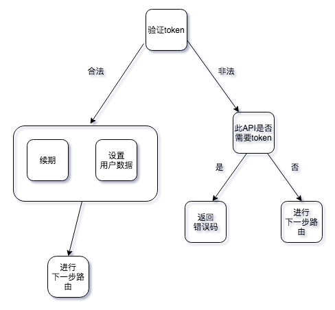

# 用户验证

[《慕课网专栏 - 从0到1 实战朋友圈移动Web App开发》](https://www.imooc.com/read/42)笔记

## 传动验证方式(session和cookie验证)

流程：

+ 输入用户名和密码登录。
+ 服务器验证通过后，在当前对话（session）里面保存相关数据，比如用户角色权限，登录时间等等。
+ 服务器向用户返回一个 sessionid，写入用户的 cookie。
+ 用户随后的每一次请求，都会通过 cookie，将 sessionid 带到服务器。
+ 服务器收到 sessionid，找到前期保存的数据，校验是否合法，由此得知用户的身份。

问题：

+ cookie+session机制，session一般存于服务器内存中，如果在单机服务下还好，但是如果是分布式或服务器集群，就要求 session 数据共享，每台服务器都能够读取 session，这样就会产生负载均衡问题。例如你在一台服务器上验证通过，但是如果后续此用户被导到另一台服务器，就无法识别验证身份了。
+ cookie+session 机制，session写入在cookie来储存，这样就有一定的CSRF安全风险。

## JSON Web Token

+ 用户登录，成功后服务器存储token并返回token给客户端。
+ 客户端收到数据后保存在客户端。
+ 客户端再次访问服务器，取出token放入http请求的headers中。
+ 服务器端采用拦截器校验，针对需要token的接口，校验成功则返回请求数据，校验失败则返回错误码。

## 本项目校验流程

+ 用户请求接口时，检查是否有token。
+ 有token就将当前用户的信息挂在req对象上，方便后面的路由方法使用。
+ 同时这里有一个续期的逻辑，因为如果我们强制将token设置成一个死的时间，那么无论多久，当时间过了之后，用户的token必定会过期，所以这个是不完美的。
+ 我们将用户的token通过cookie的方式存放在客户端，这样每次请求时，我们将token从cookie里获取到放入http的headers即可。
+ 如果你想把token存储在客户端localStorage里，也是可以的，但是并不推荐这样做，原因是localStorage在某些场景下是不可用的，例如如果浏览器是隐私模式时，而token这种数据又是及其重要的，所以建议放在cookie里最好，同时过期的逻辑可以直接由cookie控制。
