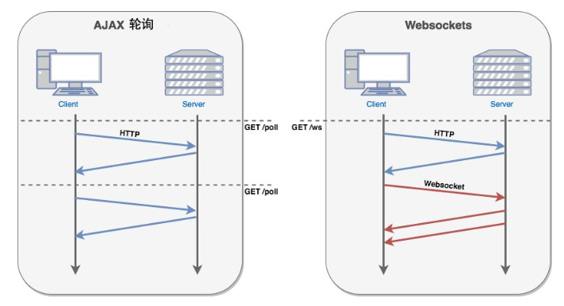

# 聊天场景分析

+ 轮询（Polling）
  
  前端不断向后台发请求以，实时更新数据，不管后台数据是否有更新都会返回数据，后端程序编写比较容易。对服务器压力大。请求中有大半是无用，浪费带宽和服务器资源。适于小型应用。

+ 长轮询（Long Polling）
  
  前端向后台发请求，后台数据如果还没有更新则不返回，直到后台数据更新了再返回给前端，前端收到后台返回的数据后才发下一次请求。在无消息的情况下不会频繁的请求。但是请求在后台一直悬挂，连接长时间保持，浪费资源。

+ WebSocket
  
  HTML5新增加的一种通信协议，目前流行的浏览器都支持这个协议，是基于TCP协议的协议。WebSocket 解决的第一个问题是，通过第一个 HTTP request 建立了 TCP 连接之后，之后的交换数据都不需要再发 HTTP request 了，使得这个长连接变成了一个真–长连接。

## Socket.io

Socket.io是一个封装了 Websocket、基于 Node 的 JavaScript 框架，包含 client 端和 server 端。

Socket.io将WebSocket和轮询（Polling）机制以及其它的实时通信方式封装成了通用的接口，并且在服务端实现了这些实时机制的相应代码。

Websocket仅仅是Socket.io实现实时通信的一个子集。另外，Socket.io 还有一个非常重要的好处。其不仅支持 WebSocket，还支持许多种轮询机制以及其他实时通信方式，并封装了通用的接口。这些方式包含 Adobe Flash Socket、Ajax 长轮询、Ajax multipart streaming 、持久 Iframe、JSONP轮询等。换句话说，当Socket.io检测到当前环境不支持WebSocket时，能够自动地选择最佳的方式来实现网络的实时通信。
